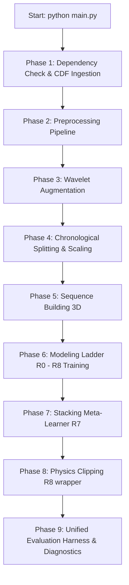

# Chapter 1: System Architecture & Data Flow

This chapter details the overarching system architecture, directories, parameter configurations, data acquisition pipeline, and the step-by-step orchestrator flow for the ISRO Space Weather Electron Flux Forecasting Pipeline.

## 1. System Overview & The Orchestrator Flow

The forecasting pipeline is designed to predict geostationary relativistic electron flux ($>2\text{ MeV}$) at three future lead times ($h$):
*   **30 Minutes** ($2$ steps of 15-minute cadence)
*   **6 Hours** ($24$ steps of 15-minute cadence)
*   **12 Hours** ($48$ steps of 15-minute cadence)

The main pipeline orchestrator is implemented in `main.py` and coordinates the system execution across nine distinct phases.



### The 9-Step Pipeline Execution Flow
1.  **Dependency Checking & Installation**: Scans the Python path for core, sequence, and optimization dependencies. Auto-installs missing packages from PyPI via `subprocess` if the `--install-deps` flag is active.
2.  **Data Ingestion**: Downloads solar-wind measurements and target geostationary electron flux from the NASA CDAWeb database for the years 2013–2016.
3.  **Preprocessing Pipeline**: Merges, despikes, and resamples GOES and Wind data streams onto a uniform 15-minute time grid. Shifts L1 observations to Earth using speed-dependent propagation.
4.  **Wavelet Transform Augmentation**: Automatically extracts sub-band energy components from the solar-wind drivers using a Discrete Wavelet Transform (DWT), appending features without target leakage.
5.  **Chronological Split & Scale**: Segments data into Train (2013-2015), Validation (H1 2016), and Test (H2 2016) splits. Fits a `StandardScaler` strictly on the train features and applies it to the validation and test sets.
6.  **3D Sequence Generation**: Constructs 3D temporal sequence arrays of size `(batch, seq_len, features)` (with `seq_len=192` steps or 48 hours) for the sequence models. Gaps are managed using a `segment_id` identifier.
7.  **Model Migration Ladder Training**: Sequentially trains and checkpoints each model level (R0 through R8) to the `models/` directory, enabling intermediate execution resuming using `--resume-from`.
8.  **Stacking Meta-Learner (Regime Blending)**: Re-fits base forecasters and trains a Ridge-based meta-blender that uses physical solar wind conditions as features to dynamically weight the baseline, flat, and sequence models.
9.  **Verification, Metrics & Diagnostics**: Compiles predictions, computes continuous and event-based performance metrics, generates benchmark summaries, and writes diagnostic plots.

---

## 2. Ingestion and Cleaning Pipeline (`src/clean.py` & `src/align.py`)

Raw CDF datasets contain instrumental gaps, cosmic ray noise spikes, and solar proton event (SPE) contamination. The data ingestion functions resolve these issues prior to feature engineering.

### Spike Removal: Median Absolute Deviation (MAD)
Spikes are identified using a rolling Median Absolute Deviation filter via `mad_despike()`. For a window size $W=11$ and threshold factor $K=6$:
$$\text{Median}_t = \text{median}(x_{t-W/2}, \dots, x_{t+W/2})$$
$$\text{MAD}_t = \text{median}(|x_{t-W/2} - \text{Median}_t|, \dots, |x_{t+W/2} - \text{Median}_t|)$$
$$\text{Threshold}_t = 6 \times 1.4826 \times \text{MAD}_t$$
Any value exceeding the threshold is marked as an outlier and replaced with `NaN`:
$$x_t = \begin{cases} x_t & \text{if } |x_t - \text{Median}_t| \le \text{Threshold}_t \\ \text{NaN} & \text{otherwise} \end{cases}$$
A safety floor of $10^{-6}$ is added to $\text{Threshold}_t$ to prevent division-by-zero during quiet periods.

### Proton Contamination Masking
Geostationary solid-state electron detectors are sensitive to high-energy protons. During Solar Proton Events (SPEs), MeV protons penetrate the electron channels, inflating the measured flux.
1.  The pipeline extracts the proton flux channel (`p_flux`).
2.  It determines the $99.9\%$ percentile threshold, defaulting to the NOAA standard threshold of $10\text{ pfu}$ (particle flux units) for $>10\text{ MeV}$ protons:
    $$\theta_{proton} = \max(\text{quantile}(p\_flux, 0.999), 10.0)$$
3.  If $p\_flux_t > \theta_{proton}$, the electron log-flux at time $t$ is replaced with `NaN`.

### L1 Spacecraft-to-Earth Propagation
The Wind spacecraft orbits at the L1 Lagrange point, approximately $1.5 \times 10^6\text{ km}$ upstream from Earth. The solar wind measurements must be time-shifted to represent conditions at the Earth's bow shock:
$$\Delta t_t = \frac{D}{V_{sw, t}}$$
Where $D = 1.5 \times 10^6\text{ km}$ and $V_{sw, t}$ is the solar wind speed in $\text{km/s}$ clamped between $200\text{ km/s}$ and $1200\text{ km/s}$. If $V_{sw}$ is missing, the training median (approx. $400\text{ km/s}$) is used as a fallback. 
The shifted timestamps are calculated as:
$$T_{\text{Earth}} = T_{\text{L1}} + \Delta t_t$$
After shifting, Wind SWE and MFI parameters are aligned with GOES-15 geostationary observations.

---

## 3. Data Alignment and Gaps (`src/align.py`)

1.  **Resampling**: Grouping is performed using `pd.Grouper(freq="15min")` to calculate the mean value over each interval, avoiding pandas downsampling issues.
2.  **Merging**: The streams are aligned using an outer join on the time index:
    ```python
    df_merged = goes_res.join([swe_res, mfi_res], how="outer").sort_index()
    ```
3.  **Interpolation**: Small gaps are filled using linear interpolation up to a limit of 3 steps ($45\text{ minutes}$). Gaps larger than 3 steps remain `NaN`.
4.  **Validity Flagging**: A boolean column `valid` is set to `True` for a row if and only if all critical variables are non-NaN:
    $$\text{valid}_t = (y_t \ne \text{NaN}) \land (V_{sw,t} \ne \text{NaN}) \land (N_{sw,t} \ne \text{NaN}) \land (Bz_t \ne \text{NaN})$$
5.  **Segment Identification**: To prevent rolling calculations and sequence windows from spanning data gaps, a `segment_id` increments at every invalid row:
    $$\text{segment\_id}_t = \sum_{i=1}^t \mathbb{I}(\neg \text{valid}_i)$$
    Contiguous valid sequences share the same integer ID.

---

## 4. Chronological Splitting & Scaling Invariants (`src/splits.py` & `src/dataset.py`)

To prevent temporal leakage, data splitting and scaling are strictly controlled:

### The Splits
*   **Training Set**: 2013-01-01 to 2015-12-31
*   **Validation Set**: 2016-01-01 to 2016-06-30
*   **Testing Set**: 2016-07-01 to 2016-12-31

### Scaling Invariant
Standardization scales features to zero mean and unit variance. To prevent validation/test set information from leaking into training:
1.  A `StandardScaler` is initialized.
2.  The scaler is fit **only** on the training features:
    $$\mu_{\text{train}} = \frac{1}{N} \sum X_{\text{train}}, \quad \sigma_{\text{train}} = \sqrt{\frac{1}{N} \sum (X_{\text{train}} - \mu_{\text{train}})^2}$$
3.  All three splits are transformed using these training statistics:
    $$X_{\text{scaled}} = \frac{X - \mu_{\text{train}}}{\sigma_{\text{train}}}$$
4.  The fitted scaler object is saved to `models/scaler.pkl` to scale input features at test time.

### Target Alignment & Gap Safety (`src/dataset.py`)
The `build_xy()` function aligns input features $X_t$ with future targets $y_{t+h}$ for the three horizons.
To prevent target gap crossing:
1.  For each horizon step $h \in \{2, 24, 48\}$, it checks:
    $$\text{valid\_mask}_t = \text{valid\_mask}_t \land (\text{segment\_id}_t == \text{segment\_id}_{t+h}) \land (y_{t+h} \ne \text{NaN})$$
2.  If the segment ID changes between $t$ and $t+h$, indicating a data gap within the forecast horizon, the row is dropped.
3.  All columns starting with `flux_lag` are dropped from the ML feature matrix to prevent direct autocorrelation leaks.
